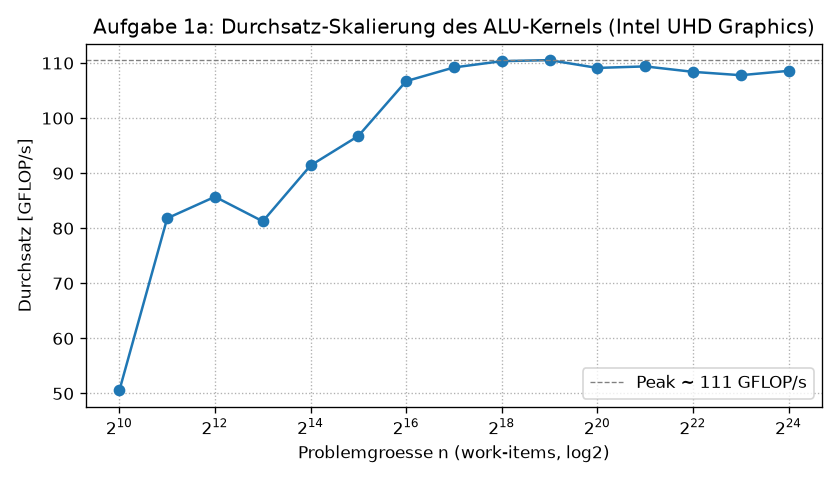
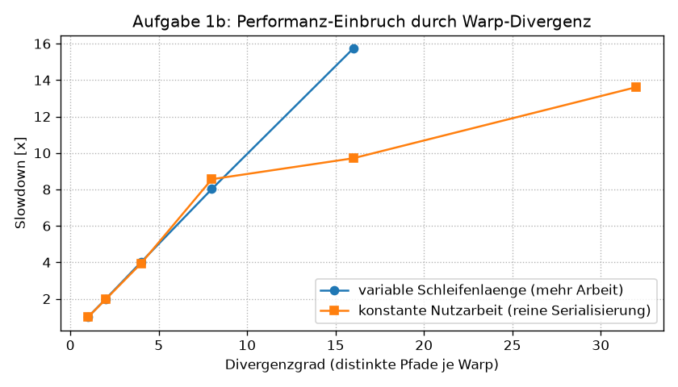
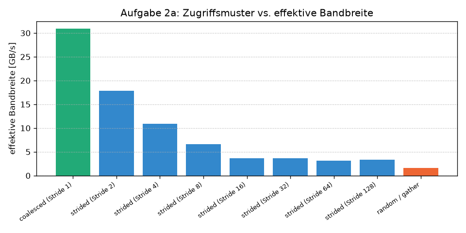
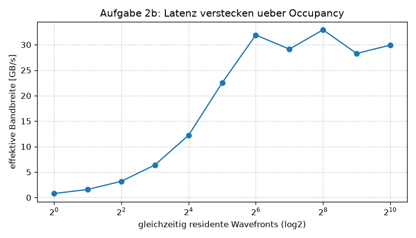

# Ergebnisbericht — Übungsblatt 2: SIMT-Ausführungsmodell & Speicherzugriff

Heterogeneous Computing, Sommersemester 2026 · Übungsblatt 2 (Aufgaben 1 & 2), in **OpenCL**.

Die Terminologie folgt durchgängig dem Vorlesungslehrbuch **Kaeli, Mistry, Schaa,
Zhang: *Heterogeneous Computing with OpenCL*, Morgan Kaufmann, 2011** (im Folgenden
„KMSZ"). Kapitelverweise beziehen sich auf dieses Buch.

## 1. Aufbau, Werkzeuge und Vorgehen

Beide Aufgaben sind als klassische OpenCL-Programme umgesetzt: **Kernel in
OpenCL C** (`kernels/*.cl`), gesteuert von einem **Host-Programm** über die
OpenCL-Runtime. Als Host-Binding dient `pyopencl`, das die OpenCL-C-API 1:1
abbildet (`clGetPlatformIDs`, `clCreateContext`, `clCreateCommandQueue`,
`clBuildProgram`, `clEnqueueNDRangeKernel` …). Die Kernel sind unverändertes
OpenCL C und liefen auf der GPU dieses Rechners.

Der Host durchläuft die **vier Schritte** aus KMSZ Kap. 2/3 („The four steps to
create a basic OpenCL application"):

1. **Platform/Device wählen** — erstes Device vom Typ `CL_DEVICE_TYPE_GPU`.
2. **Context + Command-Queue** erzeugen (Queue mit `CL_QUEUE_PROFILING_ENABLE`).
3. **Program** aus den `.cl`-Quellen **online kompilieren** (KMSZ Kap. 6).
4. **Kernel als NDRange** einreihen — mit definierter *global* und *local work
   size* (KMSZ Kap. 3/4: NDRange, work-item, work-group).

Gemessen wird über **Command-Queue-Profiling** (`clGetEventProfilingInfo`,
`CL_PROFILING_COMMAND_START/END`, KMSZ Kap. 2 „Profiling"). Das liefert die reine
**Device-Ausführungszeit** des Kernels ohne Host-Overhead. Jeder Messpunkt ist der
**Median aus 9 Läufen** nach 2 Warmup-Läufen (Warmup fängt die JIT-Kompilierung und
das erste Warmlaufen des Device ab). Der zentrale Begriff **Sub-Group** ist das
OpenCL-portable Pendant zur **Wavefront** (AMD) bzw. zum **Warp** (NVIDIA) aus
KMSZ Kap. 5 — die Menge von work-items, die die SIMT-/SIMD-Hardware im
Gleichschritt abarbeitet. Die Sub-Group-Größe wird pro Kernel über
`CL_KERNEL_PREFERRED_WORK_GROUP_SIZE_MULTIPLE` abgefragt.

### Test-Device (OpenCL-Pendant zu `deviceQuery`)

| Eigenschaft | Wert |
|-------------|------|
| Device | Intel(R) UHD Graphics (integrierte GPU) |
| Plattform / Runtime | Intel(R) OpenCL HD Graphics, **OpenCL 3.0 NEO** |
| Compute Units | **24** |
| max. Taktfrequenz | 1100 MHz |
| max. work-group size | 256 |
| Cache-Line (`CL_DEVICE_GLOBAL_MEM_CACHELINE_SIZE`) | **64 Byte** (= 16 floats) |
| Local Memory | 64 KB |
| Global Memory | ~13 GB (mit dem System-DRAM geteilt) |
| gewählte SIMD-Breite (Sub-Group) | 16 bzw. 32 (compilerabhängig, s. u.) |

Wichtige Einordnung: Es handelt sich um eine **integrierte GPU**, die sich die
DRAM-Bandbreite mit der CPU teilt. Die absoluten Zahlen liegen daher unter denen
einer diskreten GPU; die in KMSZ beschriebenen **Effekte** (SIMT-Serialisierung,
Coalescing, Latency-Hiding) treten aber unverändert und sehr deutlich auf. Die
theoretische DRAM-Peak-Bandbreite exponiert die OpenCL-API — anders als CUDAs
`deviceQuery` — nicht; als praktische Referenz dient daher die **beste gemessene
coalesced-Bandbreite** (Abschnitt 3.1).

---

## 2. Aufgabe 1 — SIMT-Ausführungsmodell und Warp-Divergenz (rechenintensiv)

Kernel: `kernels/aufgabe1.cl` · Host: `aufgabe1_simt_divergenz.py`.

Der Kernel `alu_mix` erfüllt die Vorgabe „rechenintensiv, minimaler
Speicherbedarf": jedes work-item bearbeitet **genau ein Element**, führt eine
konfigurierbare Zahl `iters` **Newton-Iterationen für √2** aus (rein arithmetisch,
`x ← x − (x²−2)/(2x)`, 5 FLOP/Iteration) und schreibt **einen einzigen** globalen
Wert. Da `iters` ein Laufzeit-Argument ist und `x` vom `global_id` abhängt, kann
der Compiler die Schleife nicht wegfalten — die ALU-Last ist real. Der Kernel ist
damit **compute-bound**; die SIMT-Ausführung, nicht die Speicherbandbreite,
limitiert (KMSZ Kap. 5).

### 2.1 Durchsatz-Skalierung über n — „Warmlaufen" des Device

`iters = 512`, *local work size* = 256, `n` von 1 024 bis 16 777 216 work-items.

| n (work-items) | Zeit [ms] | Durchsatz [GFLOP/s] |
|---------------:|----------:|--------------------:|
| 1 024 | 0,052 | 50,6 |
| 4 096 | 0,122 | 85,7 |
| 16 384 | 0,459 | 91,4 |
| **65 536** | 1,572 | **106,7** |
| 262 144 | 6,082 | 110,3 |
| 524 288 | 12,14 | **110,5** (Peak) |
| 1 048 576 | 24,60 | 109,1 |
| 4 194 304 | 99,05 | 108,4 |
| 16 777 216 | 395,5 | 108,6 |



**Beobachtung.** Bei kleinem `n` ist das Device **unterbelegt**: mit n = 1 024
(= 4 work-groups à 256) laufen nur wenige der 24 Compute Units, der Durchsatz liegt
bei ~51 GFLOP/s (≈ 46 % des Peaks). Erst ab **n ≈ 65 536 work-items** sind ≥ 95 %
des Peak-Durchsatzes erreicht — ab hier ist das Device „warmgelaufen". Der Peak von
**~110 GFLOP/s** hält danach konstant; die Ausführungszeit wächst exakt linear mit
`n` (doppeltes `n` → doppelte Zeit), das Device arbeitet im Sättigungsbereich.

Das ist genau der in der Aufgabe genannte Punkt: Um eine GPU auszulasten, müssen
**zehntausende bis Millionen work-items** gestartet werden — ein Aufwand, der bei
einer CPU-Lösung „in dieser Form gar nicht erst anfällt", weil dort schon eine
Handvoll Threads die (wenigen, breiten, out-of-order) Kerne füllt. Die GPU braucht
massiven Über-Subscribe an work-items, um ihre vielen ALUs *und* ihr
Latency-Hiding (Abschnitt 3.2) zu bedienen (KMSZ Kap. 5).

### 2.2 Warp-Divergenz — der Performanz-Einbruch

Die Intel-Sub-Group (Warp) ist für diesen Kernel **16 work-items** breit. Zwei
komplementäre Experimente auf `n = 4 194 304`:

**Variante A — datenabhängige Schleifenlänge** (`divergence_varlen`, exakt das im
Blatt vorgeschlagene „`threadIdx % k`"): Lane `l` läuft `base·(1 + l mod D)`
Iterationen. `D = 1` ⇒ alle Lanes gleich lang (keine Divergenz), `D = 16` ⇒ jede
Lane des Warps eine andere Länge (maximale Divergenz).

| Divergenzgrad D | Zeit [ms] | Slowdown | SIMT-Effizienz |
|---------------:|----------:|---------:|---------------:|
| 1 (keine) | 13,69 | ×1,00 | 100,0 % |
| 2 | 27,20 | ×1,99 | 75,0 % |
| 4 | 54,87 | ×4,01 | 62,5 % |
| 8 | 109,8 | ×8,02 | 56,2 % |
| 16 (maximal) | 215,4 | **×15,7** | 53,1 % |

**Variante B — konstante Nutzarbeit** (`divergence_skew`, Sub-Group = 32): Pro Warp
werden **immer** `S·base` Iterationen geleistet, aber auf nur `active` Lanes
konzentriert; die übrigen Lanes divergieren in den Leerlauf (`trip = 0`). Da die
*Nutzarbeit konstant* ist, misst der Zeitanstieg **ausschließlich** die
Serialisierungs-Strafe.

| aktive Lanes | SIMT-Auslastung | Zeit [ms] | Slowdown |
|-------------:|----------------:|----------:|---------:|
| 32 / 32 | 100,0 % | 12,45 | ×1,00 |
| 16 / 32 | 50,0 % | 24,54 | ×1,97 |
| 8 / 32 | 25,0 % | 48,99 | ×3,94 |
| 4 / 32 | 12,5 % | 106,6 | ×8,56 |
| 2 / 32 | 6,2 % | 120,9 | ×9,71 |
| 1 / 32 | 3,1 % | 169,4 | **×13,6** |



**Beobachtung.** In beiden Varianten bricht die Performanz mit steigender Divergenz
massiv ein — bis **Faktor ~16** (Variante A) bzw. **~14** (Variante B, bei
*identischer* Nutzarbeit!). Variante B ist der schärfere Nachweis: obwohl jede
Wavefront gleich viele Newton-Iterationen rechnet, wird sie bis zu 14-fach
langsamer, nur weil die Arbeit ungleich über die Lanes verteilt ist. (Der ideale
Faktor 32 wird nicht ganz erreicht, weil die schnelle Referenzmessung `active=32`
noch anteilig Kernel-Start-Overhead enthält; der Trend ist eindeutig und
monoton.)

**Warum serialisiert ein Warp divergente Pfade?** Eine Wavefront/ein Warp teilt
sich **einen Instruktions-Zähler und einen Instruktions-Strom**; die Lanes sind
SIMD-Spuren einer *einzigen* Vektoreinheit (KMSZ Kap. 5, SIMT). Nehmen Lanes
unterschiedliche Zweige, kann die Hardware nicht gleichzeitig zwei verschiedene
Instruktionen ausführen. Sie führt beide Pfade **nacheinander** aus und maskiert
per **Prädikation** jeweils die Lanes, die diesen Pfad nicht nehmen. Die Laufzeit
ist damit die **Summe** der genommenen Pfade, und die maskierten Lanes liegen
brach. Bei variabler Schleifenlänge läuft der Warp bis zur **längsten** Lane, alle
kürzeren warten. Genau das zeigen die Tabellen.

**Warum ist dieselbe Verzweigung auf der CPU nahezu kostenlos?** Ein CPU-Kern hat
eine **eigene skalare Pipeline** mit **Sprungvorhersage** und Out-of-Order-
Ausführung; verschiedene „Threads" laufen auf **unabhängigen Kernen** mit je
eigenem Instruktions-Strom. Eine datenabhängige Verzweigung wird i. d. R. korrekt
vorhergesagt, und es wird **nur der genommene Pfad** ausgeführt — kein
Nachbar-Thread wird dadurch ausgebremst. Es gibt keinen geteilten
Instruktions-Zähler, also auch keine Serialisierung. Genau hier wird der
SIMT-Unterschied zur „normalen" CPU sichtbar (KMSZ Kap. 5, „Threading and the CPU
vs. the GPU").

---

## 3. Aufgabe 2 — Speicherzugriff: Latenz verstecken und Bandbreite (speicherintensiv)

Kernel: `kernels/aufgabe2.cl` · Host: `aufgabe2_speicher_bandbreite.py`.

Streaming-Kernel `b[i] = a[i]·c` mit **geringer arithmetischer Intensität** (ein
global load + ein global store = 8 Byte je Element, eine Multiplikation). Der
Kernel ist damit **bandbreiten-, nicht rechenlimitiert** (KMSZ Kap. 4/5). Der
Store ist stets coalesced (`b[gid]`); variiert wird nur das **Lese**-Muster auf
`a`, um den Coalescing-Effekt sauber zu isolieren. Effektive Bandbreite =
(8 Byte · n) / Zeit. Die Korrektheit von `b = a·c` wird stichprobenartig gegen
NumPy geprüft.

### 3.1 Zugriffsmuster vs. effektive Bandbreite

`n = 16 777 216` Elemente (67 MB je Buffer), *local work size* = 256.

| Zugriffsmuster | eff. Bandbreite [GB/s] | Anteil an Referenz |
|----------------|-----------------------:|-------------------:|
| **coalesced (Stride 1)** | **31,0** | 100,0 % (Referenz) |
| strided (Stride 2) | 17,9 | 57,7 % |
| strided (Stride 4) | 11,0 | 35,4 % |
| strided (Stride 8) | 6,6 | 21,5 % |
| strided (Stride 16) | 3,6 | 11,7 % |
| strided (Stride 32) | 3,7 | 11,8 % |
| strided (Stride 64) | 3,2 | 10,3 % |
| strided (Stride 128) | 3,4 | 10,8 % |
| **random / gather** | **1,6** | **5,1 %** |



**Beobachtung.** *Coalesced* (Stride 1) ist mit ~31 GB/s das beste Muster und dient
als Referenz (100 %):
benachbarte work-items einer Wavefront lesen benachbarte Adressen, die Hardware
fasst sie zu wenigen **64-Byte-Speichertransaktionen** zusammen (KMSZ Kap. 5,
„coalescing", „memory coalescing"). Mit wachsendem *Stride* sinkt die effektive
Bandbreite fast proportional, weil eine 64-Byte-Cache-Line (= 16 floats) nur noch
**ein** nützliches Element liefert: bei **Stride ≥ 16** ist jedes Element auf einer
eigenen Cache-Line, und die Bandbreite fällt auf ~10–12 % — grob den erwarteten
Faktor 1/16. *Random/Gather* ist mit **5,1 %** am schlechtesten: ohne jede
räumliche Lokalität wird praktisch jede Anforderung ein Cache-Line-Miss, und es
kommt der zusätzliche Index-Load hinzu. Das Zugriffsmuster entscheidet also über
**bis zu Faktor 20** der real erreichten Bandbreite.

### 3.2 Latenz verstecken über die Occupancy

Occupancy = aktive Wavefronts / maximal mögliche aktive Wavefronts. Die Zahl der
gleichzeitig residenten Wavefronts wird über die **global work size** eines
Grid-Stride-Kernels (`stream_gridstride`) gesteuert — bei **konstantem
Datenvolumen** `n`. Als grobe Architektur-Obergrenze dienen ~24 CU × 7
Hardware-Threads ≈ **168** residente Wavefronts (die OpenCL-API exponiert diesen
Wert nicht; die Schätzung dient nur der Occupancy-Achse).

| residente Wavefronts | Occupancy (~) | eff. Bandbreite [GB/s] |
|---------------------:|--------------:|-----------------------:|
| 1 | 0,6 % | 0,79 |
| 2 | 1,2 % | 1,59 |
| 4 | 2,4 % | 3,19 |
| 8 | 4,8 % | 6,40 |
| 16 | 9,5 % | 12,22 |
| 32 | 19,0 % | 22,51 |
| **64** | **38,1 %** | **31,90** |
| 128 | 76,2 % | 29,13 |
| 256 | 100 % | 32,92 |
| 1024 | 100 % | 29,92 |



**Beobachtung.** Mit nur **einer** residenten Wavefront erreicht der Streaming-
Kernel lächerliche **0,8 GB/s** (~2 % des Maximums): die einzelne Wavefront stallt
bei jedem `load` auf die DRAM-Latenz, und es steht **keine andere Wavefront
bereit**, die die Wartezeit füllen könnte. Mit jeder zusätzlichen Wavefront steigt
die Bandbreite nahezu **linear** — der Scheduler schaltet bei einem Speicher-Stall
mit **nahezu null Overhead** auf eine rechenbereite Wavefront um und versteckt so
die Latenz. Ab **~64 residenten Wavefronts** ist die DRAM-Bandbreite gesättigt
(~32 GB/s), weiteres Erhöhen bringt nichts mehr. Das ist exakt die Kernaussage aus
KMSZ Kap. 5: **die GPU versteckt Speicherlatenz nicht über große Caches, sondern
über sehr viele gleichzeitig lauffähige Wavefronts** — genügend Occupancy
vorausgesetzt.

### 3.3 Zwei Latenz-Strategien und Konsequenzen für die Datenanordnung

**GPU vs. CPU — grundsätzlich anderer Mechanismus.** Die GPU versteckt Latenz über
**massive Parallelität**: viele Wavefronts, zero-overhead Kontextwechsel, dafür nur
kleine Caches (KMSZ Kap. 5). Die CPU versteckt Latenz über die **Cache-Hierarchie
und Prefetching** samt Out-of-Order-Ausführung: sequenzielle Zugriffe sind durch
Prefetch und räumliche Lokalität sehr schnell, zufällige durch Cache-Misses
langsam. Salopp: die **CPU** ist auf **einen einzelnen Thread** hin latenz-optimiert
(niedrige Latenz pro Zugriff), die **GPU** auf **Durchsatz über viele Threads**
(hohe Latenz wird durch Parallelität überbrückt).

**Konsequenzen für die effiziente Anordnung von Daten in GPU-Anwendungen** (KMSZ
Kap. 5/7):

- **Coalescing als Leitprinzip:** Daten so anlegen, dass **benachbarte work-items
  auf benachbarte Adressen** zugreifen. Das bevorzugt **Struct-of-Arrays (SoA)**
  gegenüber Array-of-Structs (AoS) — bei AoS greift jede Wavefront gestriped zu
  (vgl. Abschnitt 3.1: bis zu ×20 langsamer).
- **Gather/Scatter vermeiden bzw. lokalisieren:** zufällige Indizierung ist das
  teuerste Muster; wo unvermeidbar, hilft Sortieren/Bucketing oder das Vorladen in
  **Local Memory** (Scratchpad), um Wiederverwendung zu erzeugen.
- **Genügend Parallelität bereitstellen (Occupancy):** die Problemgröße und die
  work-group-Konfiguration so wählen, dass **genug Wavefronts resident** sind, um
  Speicher-Stalls zu überbrücken (Abschnitt 3.2). Für einen speicherintensiven
  Kernel ist ausreichende Occupancy oft wichtiger als das letzte Quäntchen
  ALU-Effizienz.
- **An der Cache-Line ausrichten:** Strukturen und Zeilen-Pitches auf Vielfache der
  64-Byte-Cache-Line legen, um Teil-Transaktionen zu vermeiden.

---

## 4. Reproduktion

Voraussetzung: eine OpenCL-fähige GPU mit installiertem ICD (hier Intel; der
OpenCL-Loader `OpenCL.dll` liegt unter Windows in `System32`).

```powershell
cd "uebung2"
python -m venv .venv
.\.venv\Scripts\Activate.ps1
pip install -r requirements.txt

python aufgabe1_simt_divergenz.py      # Aufgabe 1: Skalierung + Divergenz
python aufgabe2_speicher_bandbreite.py # Aufgabe 2: Bandbreite + Occupancy
python plots.py                        # Diagramme aus results/*.csv
```

Die Rohdaten landen als CSV in `results/`, die Diagramme als PNG. Absolutwerte
sind hardwareabhängig; die beschriebenen **Effekte** sind es nicht.

## 5. Dateien

| Datei | Inhalt |
|-------|--------|
| `kernels/aufgabe1.cl` | OpenCL-C-Kernel: `alu_mix`, `divergence_varlen`, `divergence_skew` |
| `kernels/aufgabe2.cl` | OpenCL-C-Kernel: `stream_coalesced/_strided/_gather/_gridstride` |
| `aufgabe1_simt_divergenz.py` | Host für Aufgabe 1 (Skalierung, Divergenz) |
| `aufgabe2_speicher_bandbreite.py` | Host für Aufgabe 2 (Bandbreite, Occupancy) |
| `common.py` | OpenCL-Setup, Profiling-Timing, Device-Query, CSV |
| `plots.py` | Diagramme aus den CSV-Ergebnissen |
| `results/` | CSV-Rohdaten + PNG-Diagramme |

## 6. Literatur

Kaeli, D.; Mistry, P.; Schaa, D.; Zhang, D.: *Heterogeneous Computing with OpenCL*.
Morgan Kaufmann, 2011. — Insbesondere Kap. 2/3 (OpenCL-Host, „four steps",
Profiling), Kap. 3/4 (NDRange, work-item, work-group, memory objects), Kap. 5
(GPU-Hardware: SIMT/Wavefront, Warp-Divergenz, memory coalescing, latency hiding
über Occupancy) und Kap. 6/7 (Compilation, Optimierung der Datenanordnung).
